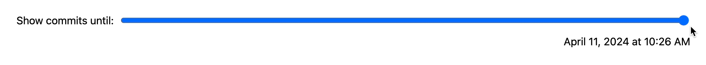

# Lab {{ page.lab }}: Animation

{: .no_toc}

{: .summary}

> In this lab, we will learn:
>
> - What different methods do we have to transition and animate elements and when to use each?
> - What considerations should we take into account for using animations effectively?

<details open markdown="block">
  <summary>
    Table of contents
  </summary>
  {: .text-delta }
- TOC
{:toc}
</details>

---

## Submission

To get checked off for the lab, please record a 1 minute video in the following order:

1. Present your interactive narrative visualization, showing that your scatter
   plot updates as you scroll down the page.
2. Present your unit visualization (you do not need to implement scrollytelling
   for the unit visualization).
3. Share the most interesting thing you learned from this lab.

**Videos longer than 1 minute will be trimmed to 1 minute before we grade, so
make sure your video is 1 minute or less.**

## [Slides](https://docs.google.com/presentation/d/1Q6CkYD5BXy18g7CT93wLh_4-1eVkwomclrXgpkt284U/edit?usp=sharing)

<!-- - [Relevant technologies (summary slide)](./slides/#technologies) -->



## What will we make?

In this lab, we will go back to the Meta page of our portfolio, and convert it
to an interactive narrative visualization that shows the progress of our
codebase over time (you may **ignore the pie chart part** in the demo since we
did not explicitly implement it for our meta tab).

<video src="videos/final.mp4" loading=lazy muted autoplay loop class="browser"></video>

<!-- ## Step 0: Clean Up

To make your code structure a little nicer, we will first complete the following refactoring steps.

{: .files }
`src/meta/main.js`

Currently, our `selectedCommits` variable is meant to reactively update and depends on `brushSelection`:

```js
selectedCommits = brushSelection ? commits.filter(isCommitSelected) : [];
```

We also have an `isCommitSelected()` function, which checks of a commit is within the `brushSelection` and looks like this:

```js
function isCommitSelected(commit) {
  if (!brushSelection) {
    if (manualSelection) {
      return manualSelection.has(commit);
    }

    return false;
  }

  let min = { x: brushSelection[0][0], y: brushSelection[0][1] };
  let max = { x: brushSelection[1][0], y: brushSelection[1][1] };
  let x = xScale(commit.date);
  let y = yScale(commit.hourFrac);

  return x >= min.x && x <= max.x && y >= min.y && y <= max.y;
}
```

However, `brushSelection` is actually only updated in one place: the `brushed()` function.
We don’t really need to keep it around once we’ve converted it to selected commits.
Let’s update the `brushed()` function to update `selectedCommits` directly:

```js
function brushed(evt) {
  let brushSelection = evt.selection;
  selectedCommits = !brushSelection
    ? []
    : commits.filter((commit) => {
        let min = { x: brushSelection[0][0], y: brushSelection[0][1] };
        let max = { x: brushSelection[1][0], y: brushSelection[1][1] };
        let x = xScale(commit.date);
        let y = yScale(commit.hourFrac);

        return x >= min.x && x <= max.x && y >= min.y && y <= max.y;
      });
}
```

Then `isCommitSelected()` can be much simpler:

```js
function isCommitSelected(commit) {
  return selectedCommits.includes(commit);
}
```

And `selectedCommits` becomes a variable that you may declare at the top level of your code:

```js
let selectedCommits = [];
```

Also, we can now make the colors of individual commits on mouse events consistent with brush selections. We can add this line of code to event handling of `mouseenter` and `mouseleave` (you should have a section that handles these two events in your **scatter plot** code):

```js
d3.select(event.currentTarget).classed('selected', ...); // give it a corresponding boolean value
``` -->

## Step 1: Evolution visualization

In this step, we will create an interactive timeline visualization that shows the evolution of our repo by allowing us to move a slider to change the date range of the commits we are looking at.

### Step 1.1: Creating the filtering UI

{: .files }
`meta/meta.js` and `meta/index.html`

In this step we will create a slider, bind its value to a variable, and display the date and time it corresponds to.
It’s very familiar to what we did in [the previous lab](../lab07/).

First, let’s create a new variable, `commitProgress`, that will represent the maximum time we want to show
as a percentage of the total time:

```js
let commitProgress = 100;
```

To map this percentage to a date, we will need a new [time scale](https://d3js.org/d3-scale/time). Once we have our scale, we can easily get from the 0-100 number to a date:

```js
let timeScale = d3
  .scaleTime()
  .domain([
    d3.min(commits, (d) => d.datetime),
    d3.max(commits, (d) => d.datetime),
  ])
  .range([0, 100]);
let commitMaxTime = timeScale.invert(commitProgress);
```

We are now ready to add our filtering UI in `meta/index.html`. This is largely a repeat of what we did in [Lab 7](../lab07/). Create the following HTML elements:

- A slider (`<input type="range">`) with a min of 0 and max of 100. Give it the id `"commit-progress"`
- A `<time>` element to display the commit time. Give it the id `"commit-time"`
- A `<label>` _around_ the slider and `<time>` element with some explanatory text (e.g. "Show commits until:").

Where you put it on the page is up to you. I placed it above my commit stats (the `<div>` element with id `stats`). I wrapped the `<label>` inside of `<div>`, to which I applied a `flex: 1` and `align-items: baseline` to align them horizontally. Then I gave `<time>` a `margin-left: auto` to push it all the way to the right.

Now, add an event listener to the slider. When the user changes the slider, the event handler should:

1. Update the `commitProgress` variable to the slider value.
2. Update the `commitMaxTime` variable to the date corresponding to the slider value using `d3.invert()`.
3. Update the `<time>` element to display the commit time using `commitMaxTime.toLocaleString()`.

I defined my event handler as a function called `onTimeSliderChange()` so I could
attach it to the slider and also call it once on page load to initialize the
time.

{: .tip }
Feel free to use any settings for `toLocaleString()` that you like.
In the screencasts below, I used `dateStyle: "long"` and `timeStyle: "short"`. You may pass these options into `toLocaleString()` method as an object.

If everything went well, your slider should now be working!



### Step 1.2: Filtering by `commitMaxTime`

{: .files }
`meta/meta.js`

Let’s now create a new `filteredCommits` variable that will
[filter](https://developer.mozilla.org/en-US/docs/Web/JavaScript/Reference/Global_Objects/Array/filter)
`commits` by comparing `commit.datetime` with `commitMaxTime` and only keep
those that are **less than** `commitMaxTime`.

```js
// Will get updated as user changes slider
let filteredCommits = commits;

function onTimeSliderChange() {
  // ...previous code
  filteredCommits = commits.filter((d) => d.datetime <= commitMaxTime);
}
```

Now, we would like to update the scatter plot of commits to only plot
`filteredCommits` rather than all of the commits. One approach is to call
`renderScatterPlot` with `filteredCommits` instead of `commits` in the
`onTimeSliderChange()` event handler. But this has a major bug! Go ahead and try
this now by making this edit:

```js
function onTimeSliderChange() {
  // ...previous code

  // What goes wrong here?
  renderScatterPlot(data, filteredCommits);
}
```

When you move the slider now, you'll see that the page produces LOTS of separate
scatter plots rather than updating the existing one. This is because
`renderScatterPlot` assumes that the `#chart` element is completely empty and
thus creates a brand-new `svg` element each time it's called by using
`.append('svg')`. Instead, we should just update the x-axis and points on the
existing scatter plot. The simplest to do this is to create a new method called
`updateScatterPlot()`. We can copy over the code from `renderScatterPlot`,
remove parts of the code that we don't need, and add new code when needed. [Here
is my first version of `updateScatterPlot()`][updatev1] that is a verbatim copy of
`renderScatterPlot`, but I've marked the parts of the code that we need to
change, remove, or keep.

[updatev1]: https://gist.github.com/SamLau95/20725ea12ef08f2471116fa48f69877f

Now, we can implement the marked changes to create the first version of
`updateScatterPlot()`. Feel free to copy this function into `meta.js`, but you
should understand what was changed and why.

```js
function updateScatterPlot(data, commits) {
  const width = 1000;
  const height = 600;
  const margin = { top: 10, right: 10, bottom: 30, left: 20 };
  const usableArea = {
    top: margin.top,
    right: width - margin.right,
    bottom: height - margin.bottom,
    left: margin.left,
    width: width - margin.left - margin.right,
    height: height - margin.top - margin.bottom,
  };

  const svg = d3.select('#chart').select('svg');

  xScale = xScale.domain(d3.extent(commits, (d) => d.datetime));

  const [minLines, maxLines] = d3.extent(commits, (d) => d.totalLines);
  const rScale = d3.scaleSqrt().domain([minLines, maxLines]).range([2, 30]);

  const xAxis = d3.axisBottom(xScale);

  // CHANGE: we should clear out the existing xAxis and then create a new one.
  svg
    .append('g')
    .attr('transform', `translate(0, ${usableArea.bottom})`)
    .call(xAxis);

  const dots = svg.select('g.dots');

  const sortedCommits = d3.sort(commits, (d) => -d.totalLines);
  dots
    .selectAll('circle')
    .data(sortedCommits)
    .join('circle')
    .attr('cx', (d) => xScale(d.datetime))
    .attr('cy', (d) => yScale(d.hourFrac))
    .attr('r', (d) => rScale(d.totalLines))
    .attr('fill', 'steelblue')
    .style('fill-opacity', 0.7) // Add transparency for overlapping dots
    .on('mouseenter', (event, commit) => {
      d3.select(event.currentTarget).style('fill-opacity', 1); // Full opacity on hover
      renderTooltipContent(commit);
      updateTooltipVisibility(true);
      updateTooltipPosition(event);
    })
    .on('mouseleave', (event) => {
      d3.select(event.currentTarget).style('fill-opacity', 0.7);
      updateTooltipVisibility(false);
    });
}
```

This function has a small bug: it can't clear out the existing x-axis because
the initial `renderScatterPlot` doesn't mark the x-axis `g` tag with a class or
id, so let's do that:

```js
function renderScatterPlot(data, commits) {
  // ...existing code
  svg
    .append('g')
    .attr('transform', `translate(0, ${usableArea.bottom})`)
    .attr('class', 'x-axis') // new line to mark the g tag
    .call(xAxis);

  svg
    .append('g')
    .attr('transform', `translate(${usableArea.left}, 0)`)
    .attr('class', 'y-axis') // just for consistency
    .call(yAxis);
  // ...existing code
}
```

Now, we can use this class in `updateScatterPlot()`:

```js
function updateScatterPlot(data, commits) {
  // ...existing code
  // remove the old x-axis code, then replace with:
  const xAxisGroup = svg.select('g.x-axis');
  xAxisGroup.selectAll('*').remove();
  xAxisGroup.call(xAxis);
}
```

After this, change `onTimeSliderChange()` to use `updateScatterPlot` instead of
`renderScatterPlot()`. Now, your scatter plot should update properly when you
interact with the slider! As an exercise, you can apply a similar logic to
`renderCommitInfo()` to update the commit statistics with the filtered commits
as well. In any case, try moving the slider and see what happens!

<video src="videos/filtering-unstable.mp4" loading=lazy muted autoplay loop class="outline"></video>

### Step 1.3: Making the circles stable

CSS transitions are already applied to our circles since Lab 6. However, you
might notice that when we move the slider, circles jump around a lot. This is
because D3 doesn't know which data items correspond to which previous data
items, so it does not necessarily reuse the right `<circle>` element for the
same commit. To tell D3 which data items correspond to which previous data
items, we can give each `circle` a _key_ that uniquely identifies the data item.
A good candidate for that in this case would be the commit id.

```js
function renderScatterPlot(data, commits) {
  // ...
  dots
    .selectAll('circle')
    .data(sortedCommits, (d) => d.id) // change this line
    .join('circle')
    .attr('cx', (d) => xScale(d.datetime))
    .attr('cy', (d) => yScale(d.hourFrac));
  // ...
}

function updateScatterPlot(data, commits) {
  // ...
  dots
    .selectAll('circle')
    .data(sortedCommits, (d) => d.id) // change this line
    .join('circle')
    .attr('cx', (d) => xScale(d.datetime))
    .attr('cy', (d) => yScale(d.hourFrac));
  // ...
}
```

Just this small addition fixes the issue completely! [Take a look at the d3
documentation for more details.][d3-key]

[d3-key]: https://d3js.org/d3-selection/joining

<video src="videos/filtering-stable.mp4" loading=lazy muted autoplay loop class="browser"></video>

### Step 1.4: Entry transitions with CSS

Notice that even though we are now getting a nice transition when an existing commit changes radius,
there is no transition when a new commit appears.

<video src="videos/filtering-no-intro.mp4" loading=lazy muted autoplay loop class="browser"></video>

<!-- We *could* fix that with Svelte transitions, but let’s try a different way,
since this is something that we can do _better_ with CSS transitions alone. -->

This is because CSS transitions fire for state changes where both the start and end changes are described by CSS.
A new element being added does not have a start state, so it doesn’t transition. We can use CSS transitions to help resolve this, by explicitly telling the browser what the start state should be.
That’s what the [`@starting-style`](https://developer.mozilla.org/en-US/docs/Web/CSS/@starting-style) rule is for!

Inside the `circle` CSS rule, add a [`@starting-style`](https://developer.mozilla.org/en-US/docs/Web/CSS/@starting-style) rule:

```css
@starting-style {
  r: 0;
}
```

If you preview again, you should notice that that’s all it took, new circles are now being animated as well!

<video src="videos/filtering-intro.mp4" loading=lazy muted autoplay loop class="browser"></video>

{: .further}

> You might notice that the largest circles and the smallest circles are _both_ transitioning with the same _duration_, which means dramatically different _speeds_.
> We may decide that this is desirable: it means all circles are appearing at once.
> However, if you want to instead keep speed constant, you can set an `--r` CSS variable on each `circle` element with its radius, and then set the transition duration to e.g. `calc(var(--r) / 100ms)`.
> You can do that only for `r` transitions like so:
>
> ```css
> transition: all 200ms, r calc(var(--r) * 100ms);
> ```

## Step 2: The race for the biggest file!

In this step we will create a unit visualization that shows the relative size of
each file in the codebase in lines of code, as well as the type and age of each
line.

### Step 2.1: Adding unit visualization for files

{: .files }
`meta/meta.js`, `meta/index.html`, and `style.css`

We want to display the file details for the commits we filtered. We'll
eventually want this section to go after the scatter plot, but for now let's add
it right after our filtering slider as that makes development faster.

First, let's obtain the file names and lines associated with each file. In
`meta.js`:

```js
// after initializing filteredCommits
let lines = filteredCommits.flatMap((d) => d.lines);
let files = d3
  .groups(lines, (d) => d.file)
  .map(([name, lines]) => {
    return { name, lines };
  });
```

Now that we have our files, let's output them (filenames and number of lines).
We will use a `<dl>` element (but feel free to make different choices, there are
many structures that would be appropriate here) to give it a simple structure.
Add this HTML under the slider in `meta/index.html`:

```html
<dl id="files">
  <!-- we want the following structure for each file:
  <div>
    <dt>
      <code>{file.name}</code>
    </dt>
    <dd>{file.lines.length} lines</dd>
  </div>
  -->
</dl>
```

Remember that we can use D3 to manipulate any HTML element, not just SVG
elements! So we can ask D3 to create the HTML we want:

```js
let filesContainer = d3
  .select('#files')
  .selectAll('div')
  .data(files, (d) => d.name)
  .join(
    // This code only runs when the div is initially rendered
    (enter) =>
      enter.append('div').call((div) => {
        div.append('dt').append('code');
        div.append('dd');
      }),
  );

// This code updates the div info
filesContainer.select('dt > code').text((d) => d.name);
filesContainer.select('dd').text((d) => `${d.lines.length} lines`);
```

We should style the `<dl>` as a grid so that the filenames and line counts are aligned.
The only thing that is a bit different now is that we have a `<div>` around each `<dt>` and `<dd>`.
To prevent that from interfering with the grid we should use [Subgrid](https://developer.mozilla.org/en-US/docs/Web/CSS/CSS_grid_layout/Subgrid):

```css
#files {
  display: grid;
  grid-template-columns: 1fr 4fr;

  > div {
    grid-column: 1 / -1;
    display: grid;
    grid-template-columns: subgrid;
  }

  dt {
    grid-column: 1;
  }

  dd {
    grid-column: 2;
  }
}
```

Now, you should see the file "visualization" appear on page load, but it won't
update when you interact with the slider. Go ahead and put the JS code we wrote
into a function called `updateFileDisplay(filteredCommits)` so that we can call
this function from `onTimeSliderChange`.

At this point, our "visualization" is rather spartan, but if you move the
slider, you should already see the number of lines changing!

<video src="videos/file-lines-basic.mp4" loading=lazy muted autoplay loop class="outline"></video>

{: .note }
You may see different summary stat changes depending on which you implemented from [Lab 6](../lab06). And if you are having trouble aligning things, revisit [Lab 2 Step 4.3](../lab02/#step-43-horizontal-alignment-with-subgrid), where we first used sub-grids to align your contact form.

### Step 2.2: Making it look like an actual unit visualization

{: .files }
`meta/meta.js`, `meta/index.html`, and `style.css`

For a unit visualization, we want to draw an element per data point (in this case, per line committed), so let's do that.
All we need to do is replace the contents of the `<dd>` element with more `<div>`, each corresponding to one line:

```html
<!-- we want to achieve this -->
<dd>
  <div class="line"></div>
</dd>
```

To do so, simply add to where we were appending `<dd>` using D3 selections previously:

```js
// append one div for each line
filesContainer
  .select('dd')
  .selectAll('div')
  .data((d) => d.lines)
  .join('div')
  .attr('class', 'loc');
```

{: .tip }
Seeing the total number of lines per file is still useful, so you may want to
add it in the `<dt>`. I used a `<small>` element, gave it `display: block` so
that it's on its own line, and styled it smaller and less opaque. You can set
both `<code>` and `<small>` tags' contents using the `.html()` method. You can
revisit it in [Lab 5 Step 2.2](../lab05/#step-22-adding-a-legend)

And then add some CSS to make it look like a unit visualization:

```css
.loc {
  display: flex;
  width: 0.5em;
  aspect-ratio: 1;
  background: steelblue;
  border-radius: 50%;
}
```

Last, we want to make sure these dots wrap and are tightly packed, so we need to add some CSS for the `<dd>` elements to allow this:

```css
dd {
  grid-column: 2;
  display: flex;
  flex-wrap: wrap;
  align-items: start;
  align-content: start;
  gap: 0.15em;
  padding-top: 0.6em;
  margin-left: 0;
}
```

At this point, we should have an actual unit visualization!

It should look something like this:

<video src="videos/file-lines-unit.mp4" loading=lazy muted autoplay loop class="outline"></video>

### Step 2.3: Sorting files by number of lines

{: .files }
`meta/meta.js`

Our visualization is not really much of a race right now, since the order of files seems random.
We need to sort the files by the number of lines they contain in descending order.
We can do that in the same place where we calculate `files`:

```js
let files = d3
  .groups(lines, (d) => d.file)
  .map(([name, lines]) => {
    return { name, lines };
  })
  .sort((a, b) => b.lines.length - a.lines.length);
```

### Step 2.4: Varying the color of the dots by technology

{: .files }
`meta/meta.js` and `style.css`

Our visualization shows us the size of the files, but not all files are created equal.
We can use color to differentiate the lines withn each file by technology.

Let’s create an ordinal scale that maps technology ids to colors:

```js
let colors = d3.scaleOrdinal(d3.schemeTableau10);
```

Then, we can use this scale to color the dots:

```js
filesContainer
  // ...existing lines
  .attr('style', (d) => `--color: ${colors(d.type)}`);
```

Lastly, you should edit the `background` CSS for the `.loc` elements to use the
new color.

Much better now!

<video src="videos/file-lines-colored.mp4" loading=lazy muted autoplay loop class="outline"></video>

## Step 3: Scrollytelling Part 1 (commits over time)

{: .files }
`meta/meta.js`, `style.css`, and `meta/index.html`.

So far, we have been progressing through these visualizations by moving a
slider. However, these visualizations both tell a story, the story of how our
repo evolved. Wouldn’t it be cool if we could _actually_ tell that story in our
own words, and have the viewer progress through the visualizations as they
progress through the narrative?

Let’s do that!

### Step 3.1: Setting up the HTML

{: .files }
`meta/index.html`.

Let's implement our own Scrolly for the meta page! We will use [the Scrollama
package][scrollama], developed by Russell Samora from the Pudding.

[scrollama]: https://pudding.cool/process/introducing-scrollama/

First, let's move the unit visualizations for the files below the scatter plot
since we'll focus on the scatter plot for now.

```html
<!-- rest of the code above -->

<!-- this is moved right to the end of the body tag -->
<dl id="files"></dl>
```

We'd like to have some explanatory text on the left side of the screen and the
scatter plot on the right side. To do this, start by wrapping the scatter plot
and the `<div>` tags that get updated when the user brushes in a `<div>` with id
`scatter-plot`. Then, add a `<div>` with id `scatter-story` above
`scatter-plot`. Finally, wrap both `scatter-story` and `scatter-plot` in a
`<div>` with id `scrolly-1`. The final HTML should look like:

```html
<!-- old code -->
<div id="scrolly-1">
  <div id="scatter-story">some filler text here</div>
  <div id="scatter-plot">
    <!-- old code -->
  </div>
</div>
<!-- old code -->
```

{: .files }
`style.css`.

Let's make the two-column layout now:

```css
#scrolly-1 {
  position: relative;
  display: flex;
  gap: 1rem;

  > * {
    flex: 1;
  }
}

#scatter-story {
  position: relative;
}

#scatter-plot {
  position: sticky;
  top: 0;
  left: 0;
  bottom: auto;
  height: 50vh;
}
```

Note that setting the `height` for `#scatter-plot` is very important, since
otherwise `position: sticky` won't have an effect.

### Step 3.2: Generating commit text

{: .files }
`meta/meta.js`

Now, let's generate some filler text for each commit. In `meta.js`, add this to
the bottom:

```js
d3.select('#scatter-story')
  .selectAll('.step')
  .data(commits)
  .join('div')
  .attr('class', 'step')
  .html(
    (d, i) => `
		On ${d.datetime.toLocaleString('en', {
      dateStyle: 'full',
      timeStyle: 'short',
    })},
		I made <a href="${d.url}" target="_blank">${
      i > 0 ? 'another glorious commit' : 'my first commit, and it was glorious'
    }</a>.
		I edited ${d.totalLines} lines across ${
      d3.rollups(
        d.lines,
        (D) => D.length,
        (d) => d.file,
      ).length
    } files.
		Then I looked over all I had made, and I saw that it was very good.
	`,
  );
```

Feel free to change the text as you want. The important thing is that each
generated `<div>` tag has the `.step` class, so we can give them to Scrollama
later. If the generated text doesn't take up an entire screen's worth of space,
feel free to add some `padding-bottom` to each `.step` to space them out.

At this point, you should be able to scroll down the page and see that the
scatter plot remains at the top of the screen as you scroll past your commit
descriptions. You should also see that when you scroll past the commit
descriptions, the scatter plot also goes off-screen.

### Step 3.3: Making it update

{: .files }
`meta/meta.js`

Now, let's use Scrollama to automatically update our scatter plot as we scroll
past commits!

Add this to the bottom of top of your JS file to import Scrollama:

```js
import scrollama from 'https://cdn.jsdelivr.net/npm/scrollama@3.2.0/+esm';
```

Now, add this to the bottom of your JS file to use the library:

```js
function onStepEnter(response) {
  console.log(response);
}

const scroller = scrollama();
scroller
  .setup({
    container: '#scrolly-1',
    step: '#scrolly-1 .step',
  })
  .onStepEnter(onStepEnter);
```

As you scroll up and down the commit descriptions, you should see an object
logged each time a commit crosses the mid-point of the screen. Now, all we need
to do is figure out the date of that commit and we can update our scatter plot
accordingly. Luckily for us, D3 attaches the original data object to
elements that it creates, so we can revise `onStepEnter` as follows to log the
commit date:

```js
function onStepEnter(response) {
  console.log(response.element.__data__.datetime);
}
```

**Your Task:** Reuse the code you wrote earlier in this lab to update the
scatter plot, just like we did when implementing the slider. Note that if you
get this working but your commits appear in a weird order, you may need to sort
the commits by datetime in `processCommits`.

Congratulations! You have just implemented your first scrollytelling visualization!

## Step 4: Scrollytelling Part 2 (file sizes, optional)

As an optional next step, you can clean up your meta page a bit. For example,
you don't need the slider at the top of the screen anymore since we're using
scrolling to accomplish the same animation.

To get more practice implementing scrollytelling, see if you can also implement
scrollytelling for the unit visualizations of file sizes. The easiest way to do
this is to generate a copy of the commit descriptions, then repeat our process
for the scatter plot for the unit visualizations as well.

## Resources

### Transitions & Animations

Tech:

- [Cheatsheet on animation-related technologies](./slides/#technologies)
- [An interactive guide to CSS transitions](https://www.joshwcomeau.com/animation/css-transitions/)

### Scrollytelling

- [Scrollama
  documentation](https://github.com/russellsamora/scrollama?tab=readme-ov-file)
- [Example of Scrollama for a side-by-side scrollytelling (similar to our
  lab)](https://russellsamora.github.io/scrollama/sticky-side/)
  - [source code for example](https://github.com/russellsamora/scrollama/blob/main/docs/sticky-side/index.html)
- [More Scrollama examples](https://github.com/russellsamora/scrollama/tree/main/docs)

Cool examples:

- [This is a teenager](https://pudding.cool/2024/03/teenagers/)
- [A visual introduction to Machine Learning Part 1](http://www.r2d3.us/visual-intro-to-machine-learning-part-1/)
- [A visual introduction to Machine Learning Part 2](http://www.r2d3.us/visual-intro-to-machine-learning-part-2/)
- [Ben & Jerry’s](https://benjerry.heshlindsdataviz.com/)


